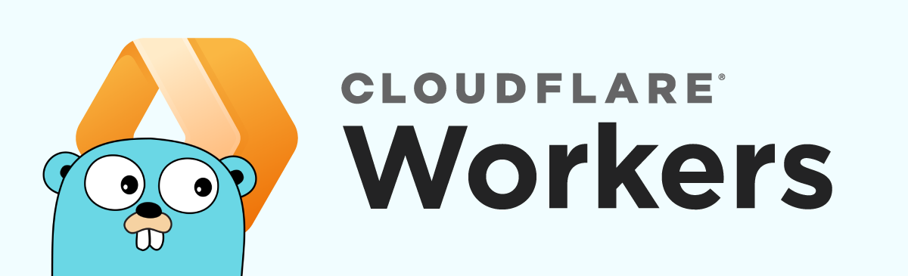

Powered by  Vite and  Cloudflare Workers

# workers-go

This repository is a fork of https://github.com/syumai/workers ❤️

`workers-go` is a pure Go library, made to help interface Go's WASM with [Cloudflare Workers](https://workers.cloudflare.com/).
It implements a series of handlers, helpers and bindings, making easier to integrate Go with Workers

## Install

This project has only been tested on **Go 1.23+** with **NodeJS 22+**


```bash
go get github.com/Darckfast/workers-go
```

## Go to JS Handlers

Setting the handler in go, will make certain callbacks available in JavaScript global scope

| Go func | JS callback |
|-|-|
|`fetch.ServeNonBlock()`| `globalThis.cf.fetch()`|
|`cron.ScheduleTaskNonBlock()` | `globalThis.cf.scheduled()`|
|`queues.ConsumeNonBlock()`|`globalThis.cf.queue()`|
|`tail.ConsumeNonBlock()`|`globalThis.cf.tail()`|
|`email.ConsumeNonBlock()`|`globalThis.cf.email()`|


## `fetch` handler

Implement your `http.Handler` and give it to `fetch.ServeNonBlock()`.

```go
//go:build js && wasm

package main

import "github.com/Darckfast/workers-go/cloudflare/fetch"

func main() {
	var handler http.HandlerFunc = func (w http.ResponseWriter, req *http.Request) {
    //...
  }
	fetch.ServeNonBlock(handler)

  <-make(chan struct{})
}
```

or just call `http.Handle` and `http.HandleFunc`, then invoke `workers.Serve()` with nil.

```go
//go:build js && wasm

package main

import "github.com/Darckfast/workers-go/cloudflare/fetch"

func main() {
	http.HandleFunc("/hello", func (w http.ResponseWriter, req *http.Request) {
    //...
  })

	fetch.ServeNonBlock(handler)// if nil is given, http.DefaultServeMux is used.

  <-make(chan struct{})
}
```

## `scheduled` handler

```go
//go:build js && wasm

package main

import "github.com/Darckfast/workers-go/cloudflare/cron"


func main() {
	cron.ScheduleTaskNonBlock(func(event *cron.CronEvent) error {
    // ... my scheduled task
		return nil
	})

  <-make(chan struct{})
}
```

## `queue` handler

```go
//go:build js && wasm

package main

import 	"github.com/Darckfast/workers-go/cloudflare/queues"

func main() {
	queues.ConsumeNonBlock(func(batch *queues.MessageBatch) error {
		for _, msg := range batch.Messages {

      // ... process the message

			msg.Ack()
		}

		return nil
	})

  <-make(chan struct{})
}
```

## `tail` handler

```go
//go:build js && wasm

package main

import "github.com/Darckfast/workers-go/cloudflare/tail"


func main() {
	tail.ConsumeNonBlock(func(f *[]tail.TailItem) error {
    // ... process tail trace events
		return nil
	})

  <-make(chan struct{})
}
```

## `email` handler

```go
//go:build js && wasm

package main

import "github.com/Darckfast/workers-go/cloudflare/email"


func main() {
	email.ConsumeNonBlock(func(f *email.ForwardableEmailMessage) error {
    // ... process the email
		return nil
	})

  <-make(chan struct{})
}
```

## Making HTTP Request
For compatibility reasons, you **must** use the `fetch.Client{}` to make http request, as it interfaces Go's http with Cloudflare Worker `fetch()` API

```go
r, _ := http.NewRequest("GET", "https://google.com", nil)
c := fetch.Client{
  Timeout: 5 * time.Second,
}

// Timeouts return error
rs, err := c.Do(r)

defer rs.Body.Close()
b, _ := io.ReadAll(rs.Body)

fmt.Println(string(b))
```

## `main.ts`

`main.ts` is the entry point, declared in the `wrangler.toml`, and its where the wasm binary
will be loaded and used

Below is a (_non functional_) example, for a functional and complete example check `./worker/bin/main.ts`

```ts
import app from "./bin/app.wasm"; // Compiled wasm binary
import "./bin/wasm_exec.js"; // cp "$(go env GOROOT)/lib/wasm/wasm_exec.js" .

/**
  * This function is what initialize your Go's compiled WASM binary
  * only after this function has finished, that the handlers will be
  * defined in the globalThis scope
  *
  * At the moment, due limitations with the getRandomData(), this block
  * cannot be executed at top level, it must be contained within the handlers
  * scope
  *
  * It's REQUIRED and needs to be called before using the globalThis.cf.<handler>()
  */
function init() {
  const go = new Go()

  /*
  * This will execute the binary, and all Go's `init()` will run and instantiate
  * the callbacks. They all will be within the globalThis.cf object
  */
  go.run(new WebAssembly.Instance(app, go.importObject))
}

async function fetch(req: Request, env: Env, ctx: ExecutionContext) {
  init()
  return await globalThis.cf.fetch(req, env, ctx);
}

export default {
  fetch,
} satisfies ExportedHandler<Env>;
```

## Building and deploying

To build locally, you can run
```bash
vite build
```
This will compile the wasm binary, and flat the JS dependencies into a single file, the out dir is `dist` or `./worker/dist`

To deploy, just run
```bash
wrangler build
```

The `wrangler` CLI will auto detect, build the project and compress the final `gzip` file

If this is your first Cloudflare Worker, [check their documentation](https://developers.cloudflare.com/learning-paths/workers/get-started/first-worker/#build-and-deploy-your-first-worker)

## Features

Below is a list of implemented, and not implemented Cloudflare features

| Feature                      | Implemented | Notes                                                                                                                                            |   |
|------------------------------|-------------|--------------------------------------------------------------------------------------------------------------------------------------------------|---|
| `fetch`                      | ✅           | All functions uses either `http.Request` or `http.Response`                          |   |
| `queue`                      | ✅           |                                                                                                                                                  |   |
| `email`                      | ✅           |                                                                                                                                                  |   |
| `scheduled`                  | ✅           |                                                                                                                                                  |   |
| `tail`                       | ✅           | **EXPERIMENTAL**: This has not been tested in production env yet                                                                                 |   |
| Env                          | ✅           | All Cloudflare Worker's env are copied into `os.Environ()`, making them available at runtime with `os.Getenv()`. Only string typed values are copied |   |
| Containers                   | 🔵          | Only the `containerFetch()` function has been implemented                                                                                        |   |
| R2                           | 🔵          | _Options for R2 methods still not implementd_                                                                                                    |   |
| D1                           | 🔵          |                                                                                                                                                  |   |
| KV                           | 🔵          | _Options for KV methods still not implemented_                                                                                                   |   |
| Cache API                    | ✅           |                                                                                                                                                  |   |
| Durable Objects              | 🔵          | _Only stub calls have been implemented_                                                                                                          |   |
| RPC                          | ❌           | _Not implemented_                                                                                                                                |   |
| Service binding              | ✅           | `fetch.Client{}.WithBinding(serviceName)`. only works for `fetch` or HTTP requests                                                                                                                          |   |
| HTTP                         | ✅           | native fetch interface using `fetch.Client{}.Do(req)`                                                                                            |   |
| HTTP Timeout                 | ✅           | Implemented using the same interface as `http.Client{ Timeout: 20 * time.Second }`                                                               |   |
| HTTP RequestInitCfProperties | ✅           | Implemented all but the `image` property, they must be set on the `http.Client{ CF: &RequestInitCF{} }`                                          |   |
| FetchEvent                   | ✅          |                                                                                                                                                  |   |
| TCP Sockets                  | ✅          |                                                                                                                                                  |   |
| Queue producer               | ✅          |                                                                                                                                                  |   |


## ⚠️ Caveats

###  C Binding
IF you use any library or package that depends or use any C binding, or C compiled code, compiling to WASM is not possible

Some examples

| Package | Compatible |
|-|-|
|https://github.com/anthonynsimon/bild|✅|
|https://github.com/nfnt/resize|✅|
|https://github.com/bamiaux/rez|✅|
|https://github.com/kolesa-team/go-webp|❌|
|https://github.com/Kagami/go-avif|❌|
|https://github.com/h2non/bimg|❌|
|https://github.com/davidbyttow/govips|❌|
|https://github.com/gographics/imagick|❌|

### HTTP Requests
When making http request, the `fetch.NewClient()` must be used, as it implements the Cloudflare Worker native `fetch()` call

### Queues
Cloudflare Queue locally is incredibly slow to produce events (up to 7 seconds)

### TinyGo
Go's compiled binary can exceed the Free 3MB Cloudflare Worker's limit, in which case one suggestion is to use TinyGo to compile, but for performance reasons `workers-go` uses the `encoding/json` from the std Go's library, which makes this package incompatible with the current build of TinyGo

Another possible fix is related to this issue https://github.com/golang/go/issues/63904

### Errors
Although we can wrap JavaScript errors in Go, at the moment there is no source maps available in wasm, meaning we can get errors messages, but not a useful stack trace

### Build constraint
For [gopls](https://github.com/golang/tools/tree/master/gopls) to show `syscall/js` method's signature and auto complete, either `export GOOS=js && export GOARCH=wasm` or add the comment `//go:build js && wasm` at the top of your Go files

