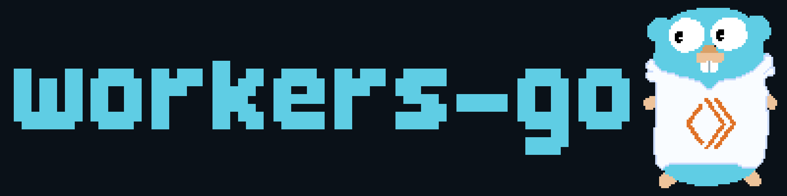

  <a href="https://darckfast.com/docs/workers-go">
    
    <h1 align="center">workers-go</h1>
  </a>

  workers-go is fork of <a href="https://github.com/syumai/workers">syumai's workers</a> ❤️ — a lightweight package for building and running Go on NodeJS, Bun, Deno and <a href="https://workers.cloudflare.com/">Cloudflare Workers</a> using WebAssembly (WASM).

Powered by Cloudflare Wrangler

  <a href="https://darckfast.com/docs/workers-go"><strong>📜 docs</strong></a>
  <a href="https://codeberg.org/darckfast/workers-go"><strong>🧬 main repository</strong></a>
  <a href="https://github.com/Darckfast/workers-go"><strong>🪞 mirror repository</strong></a>

  <i>GitHub is a mirror, all development is centered on codeberg.org. Issues are welcomed on both</i>

---

[Check the documentation](https://darckfast.com/docs/workers-go)
